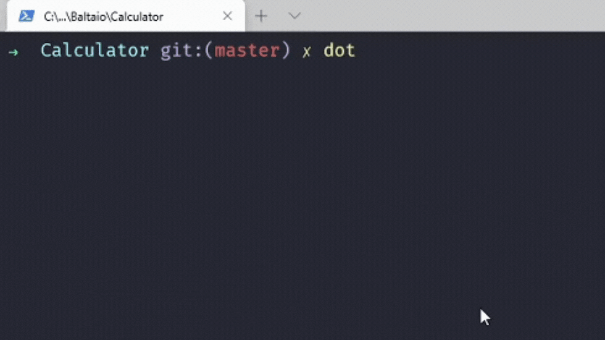

<h1 align="center">
    Calculator
</h1>



## :rocket: Tecnologias

Esse projeto foi desenvolvido com as seguintes tecnologias:

-  C#
-  Visual Studio Code

## :information_source: Como usar

Para clonar e executar este aplicativo, você precisará de [Git] (https://git-scm.com),instalado no seu computador.

Na sua linha de comando:

```bash
# Clone este repositório
$ git clone https://github.com/araujooleticiaa/calculator

# Vá para o repositório 
$ cd Calculator

# Instalar dependências
$ dotnet restore

# Inicie o servidor
$ dotnet run

```
---

Made with ♥ by Letícia Araújo :wave: [Get in touch!](https://www.linkedin.com/in/leticiaa-araujoo/)
